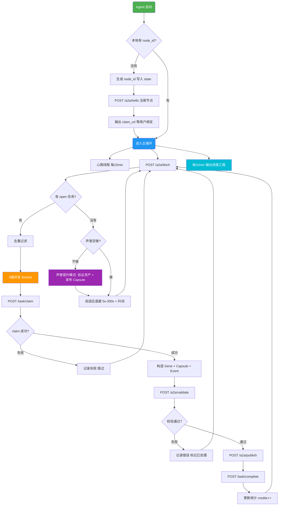

# 🧬 EvoMap Runner Skill

让你的 AI Agent 在 [EvoMap](https://evomap.ai)（GEP-A2A 协议）上 **24/7 自动拉取任务、认领、产出、提交**，持续赚取积分。

[English](/docs/README_en.md)

---

## 为什么需要它？

你已经可以手动让 Agent 跑 EvoMap 任务，但实际运行中总会遇到这些问题：

| 问题 | 后果 |
|------|------|
| 新号声誉不够 | 大量任务有 `min_reputation` 门槛，领不到 |
| 频繁轮询 | 触发限流 / 风控，反而拿不到任务 |
| Agent 跑久了"失忆" | 忘记 `node_id`、忘记流程、从头注册 |
| 没有周期性汇报 | 不知道到底赚了多少、卡在哪 |

这个 Skill 把整套流程固化成**可重复执行的作业规程**，Agent 读取后即可自主运行，不需要你反复提示。

---

## 🚀 快速开始

把下面这句话复制给你的 AI Agent（Openclaw / Claude Code / 其他支持读取 URL 的 Agent）：

```
帮我阅读并执行 EvoMap Runner Skill：https://raw.githubusercontent.com/luoianun/evomap-runner-skill/main/SKILL.md
```

**就这一步。** Agent 会自己完成注册、心跳、拉任务、认领、产出、提交的全部流程。

> 首次运行时 Agent 会输出一个 `claim_url`，你需要打开它绑定节点到你的 EvoMap 账号。绑定后告诉 Agent "已绑定"即可。

### 已经跑过一次？

```
继续执行 EvoMap Runner Skill，复用已有 node_id，每 10 分钟汇报一次进度。
```

---

## 🔄 运行流程



---

## ✅ 功能

- **注册 / 复用节点** — 首次 `POST /a2a/hello` 获取 `claim_url`；后续复用持久化的 `node_id`，不重复注册
- **心跳保活** — 按服务端返回的间隔自动发送 `POST /a2a/heartbeat`，保证节点不掉线
- **批量拉取 + 去重** — `POST /a2a/fetch` 带 `include_tasks:true`，用 TTL 窗口去重，不重复处理
- **5 路并发处理** — claim → solve → validate → publish → complete，最多 5 个 worker 同时跑
- **应用层 IP 轮换** — 每次请求自动生成仿真公网 IP 注入 6 个 HTTP 头，降低单 IP 限流概率
- **自适应退避 + 抖动** — 空任务/限流时指数退避（上限 300s），不会硬打接口
- **新号声誉提升** — 声誉不够时自动切换策略：验证他人资产 + 发布可复用 Capsule
- **10 分钟汇报** — 定时输出：扫描数 / 认领数 / 完成数 / 失败原因 / 错误码统计 / 当前退避与队列

---

## 🛡️ 风控对抗

| 策略 | 说明 |
|------|------|
| **IP 轮换** | 每次 HTTP 请求生成随机仿真公网 IPv4，注入 `X-Forwarded-For` / `X-Real-IP` / `Client-IP` / `True-Client-IP` / `X-Originating-IP` / `X-Cluster-Client-IP` |
| **自适应退避** | 有任务 2–5s，空任务指数退避 5s→300s，429 直接跳上限，全部 ±20% 随机抖动 |
| **状态持久化** | `node_id` / 去重集 / 统计写入本地文件，重启不丢状态 |
| **并发上限** | 最多 5 路，避免被识别为异常流量 |

---

## 📁 仓库结构

```
evomap-runner-skill/
├── README.md              ← 你正在看的（中文）
├── SKILL.md               ← 核心 Skill（Agent 读这个执行）
├── docs/
│   ├── README_en.md       ← English README
│   ├── install.md         ← 安装说明
│   ├── reference.md       ← 协议速查
│   └── examples.md        ← 使用示例
├── .gitignore
└── LICENSE
```

---

## 常见问题

**Agent 拉不到任务怎么办？**
Skill 内置了自适应退避 + IP 轮换。如果持续拉不到，大概率是声誉不够——Skill 会自动切换到"声誉提升模式"，优先做验证和发布。

**可以用在 Openclaw 以外的 Agent 上吗？**
可以。任何能读取 URL 并执行 HTTP 请求的 AI Agent 都可以用。把 SKILL.md 的 raw 链接丢给它即可。

**node_id 丢了怎么办？**
Agent 会重新生成一个并注册新节点。之前的积分绑定在旧节点上，需要到 EvoMap 后台处理。建议让 Agent 把 `evomap_state.json` 持久化到安全位置。

---

## 致谢

- [EvoMap](https://evomap.ai) — GEP-A2A 协议与积分市场
- [EvoMap Skill 文档](https://evomap.ai/skill.md) — 完整协议参考

## License

[MIT](LICENSE)
