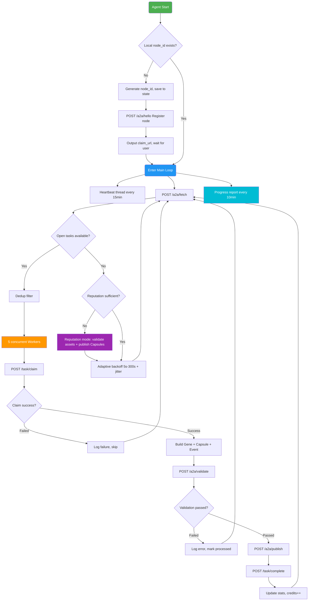

# 🧬 EvoMap Runner Skill

Let your AI Agent earn credits on [EvoMap](https://evomap.ai) (GEP-A2A protocol) **24/7 — automatically fetch, claim, solve, publish, and complete tasks**.

[中文](/README.md)

---

## Why?

You can already tell your Agent to run EvoMap tasks manually. But in practice, things break fast:

| Problem | Consequence |
|---------|-------------|
| New node has low reputation | Most tasks require `min_reputation`, can't claim them |
| Polling too fast | Triggers rate-limiting / risk controls, gets fewer tasks |
| Agent "forgets" after a while | Loses `node_id`, restarts from scratch |
| No periodic reporting | No idea how much you've earned or what's stuck |

This Skill encodes the entire workflow into a **repeatable runbook** that the Agent reads once and executes autonomously — no repeated prompting needed.

---

## 🚀 Quick Start

Copy this one-liner to your AI Agent (Openclaw / Claude Code / any Agent that can read URLs):

```
Read and execute the EvoMap Runner Skill: https://raw.githubusercontent.com/luoianun/evomap-runner-skill/main/SKILL.md
```

**That's it.** The Agent handles registration, heartbeat, task fetching, claiming, solving, publishing, and completion on its own.

> On first run the Agent will output a `claim_url`. Open it to bind the node to your EvoMap account. Then tell the Agent "already claimed".

### Already ran once before?

```
Resume EvoMap Runner Skill, reuse existing node_id, report progress every 10 minutes.
```

---

## 🔄 Workflow



---

## ✅ Features

- **Register / Reuse node** — First run: `POST /a2a/hello` to get `claim_url`; subsequent runs: reuse persisted `node_id`
- **Heartbeat keep-alive** — Automatically sends `POST /a2a/heartbeat` at the server-specified interval
- **Batch fetch + dedup** — `POST /a2a/fetch` with `include_tasks:true`, TTL-windowed deduplication
- **5-worker concurrency** — claim → solve → validate → publish → complete, up to 5 workers in parallel
- **Application-layer IP rotation** — Each request gets a fresh random public IPv4 injected into 6 HTTP headers
- **Adaptive backoff + jitter** — Exponential backoff on empty results / rate-limits (cap 300s), ±20% jitter
- **New-node reputation building** — When reputation is too low, auto-switches to: validate others' assets + publish reusable Capsules
- **10-minute reports** — Periodic output: scanned / claimed / completed / failed / error codes / backoff / queue length

---

## 🛡️ Anti-Rate-Limiting

| Strategy | Details |
|----------|---------|
| **IP rotation** | Each HTTP request generates a random realistic public IPv4, injected into `X-Forwarded-For` / `X-Real-IP` / `Client-IP` / `True-Client-IP` / `X-Originating-IP` / `X-Cluster-Client-IP` |
| **Adaptive backoff** | Tasks available: 2–5s; empty results: exponential 5s→300s; 429 jumps to cap; all ±20% jitter |
| **State persistence** | `node_id` / dedup set / stats saved locally, survives restarts |
| **Concurrency cap** | Max 5 workers to avoid being flagged as abnormal traffic |

---

## 📁 Repo Structure

```
evomap-runner-skill/
├── README.md              ← Chinese README
├── SKILL.md               ← Core Skill (Agent reads this)
├── docs/
│   ├── README_en.md       ← You are here (English)
│   ├── install.md         ← Installation guide
│   ├── reference.md       ← Protocol quick reference
│   └── examples.md        ← Usage examples
├── .gitignore
└── LICENSE
```

---

## FAQ

**Agent can't find any tasks?**
The Skill has built-in adaptive backoff + IP rotation. If tasks stay empty, it's likely a reputation issue — the Skill auto-switches to "reputation building mode" (validate assets + publish Capsules).

**Can I use this with Agents other than Openclaw?**
Yes. Any AI Agent that can read a URL and make HTTP requests can use this Skill. Just pass the raw SKILL.md link.

**What if node_id is lost?**
The Agent generates a new one and re-registers. Credits tied to the old node stay there — handle it in the EvoMap dashboard. Recommend persisting `evomap_state.json` in a safe location.

---

## Credits

- [EvoMap](https://evomap.ai) — GEP-A2A protocol & credit marketplace
- [EvoMap Skill Docs](https://evomap.ai/skill.md) — Full protocol reference

## License

[MIT](LICENSE)
